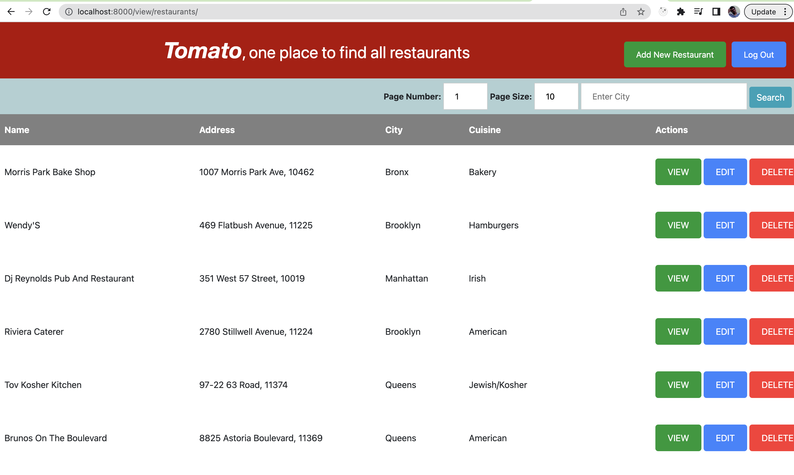

# sample_restaurant

Node application for sample restaurant

Using handlebars template engine for showing web pages.

## Authentication

Using Passport.js to authenticate.

## Database

MongoDB database is used to store information about restaurants and users.

## Output

#### References
* [Modal Bootstrap](https://getbootstrap.com/docs/4.3/components/modal/)
